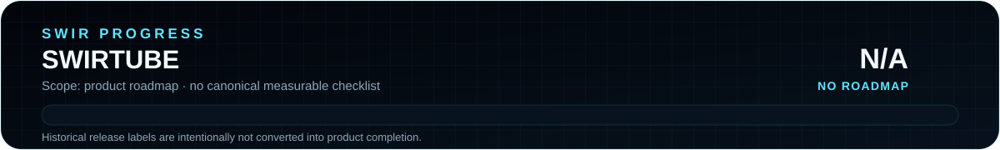

<!-- SWIR-README-STANDARD:v2 -->

<div align="center">


<br>


[](https://github.com/Swir)
[](https://github.com/Swir/SwirTube/stargazers)

[**Highlights**](#-highlights) · [**Quick Start**](#-quick-start) · [**Usage**](#-usage) · [**Releases**](#-releases)

</div>

<p align="center">
  
</p>

**Product roadmap progress:** N/A — this repository has no canonical checklist or weighted roadmap from which a truthful product-completion percentage can be reproduced.


## 📍 Project Status

| Item | Status |
|---|---|
| Current stage | Maintained lightweight terminal utility |
| Interface | Python terminal / Rich |
| Download engine | `yt-dlp` |
| Audio post-processing | FFmpeg, when MP3 extraction is selected |
| Latest public GitHub release | **SwirTube 2.0** — historical tag [`Swirtvube`](https://github.com/Swir/SwirTube/releases/tag/Swirtvube), published 2024-11-22 |
| Product roadmap | No canonical measurable roadmap |

## 🚀 Overview

**SwirTube** is a small Python terminal frontend for `yt-dlp` focused on straightforward YouTube download workflows. It adds a Rich-based menu and progress display, optional cookie-file use, local JSON configuration, operation logging and optional FFmpeg audio extraction.

The current source is deliberately simple: `swirtube.py` contains the interactive workflow and `requirements.txt` lists the two Python dependencies. FFmpeg is an external executable and is needed only for the MP3 path.

<div align="center">

</div>

## ✨ Highlights

| Feature | What it does |
|---|---|
| 🎬 Video download | Passes the supplied HTTP URL to `yt-dlp` and saves the selected best format in the current working directory. |
| 🎵 MP3 extraction | Uses the `FFmpegExtractAudio` post-processor with MP3 as the preferred codec and 192 kb/s preferred quality. |
| 📊 Rich terminal UI | Shows menus, status messages and a byte-based progress bar. |
| ⚙️ FFmpeg configuration | Uses FFmpeg from `PATH` or a user-supplied executable path stored in local config. |
| 🍪 Cookie file detection | Uses a local `cookies.txt` automatically when that file is present. |
| 💾 Local configuration | Stores the configured FFmpeg path in `config.json`. |
| 📜 Local logging | Writes operation and error messages to `downloader.log`. |
| ⏹️ Safe interruption | Handles `Ctrl+C` and reports the interrupted operation instead of hiding the exception. |

## ⚙️ Quick Start

### From source

```bash
git clone https://github.com/Swir/SwirTube.git
cd SwirTube
python -m venv .venv
```

Activate the environment on Windows:

```powershell
.venv\Scripts\activate
```

or on Linux/macOS:

```bash
source .venv/bin/activate
```

Install the Python dependencies and run:

```bash
pip install -r requirements.txt
python swirtube.py
```

For **audio / MP3 extraction**, install FFmpeg separately and either place it in `PATH` or choose its executable path from the SwirTube menu.

## 📋 Requirements / Compatibility

- Python 3 capable of installing the current `yt-dlp` and `rich` packages.
- Network access required by `yt-dlp` for the selected media URL.
- FFmpeg for the MP3 extraction workflow.
- A normal terminal that supports Rich output.
- Write access to the working directory for downloaded media, `config.json` and `downloader.log`.

There is currently no repository CI matrix that proves a specific Python-version or operating-system range, so this README does not invent one.

## 🎮 Usage

1. Run `python swirtube.py`.
2. Choose **Download from YouTube**.
3. Enter an HTTP/HTTPS media URL.
4. Choose **Video** or **Audio (MP3)**.
5. If `cookies.txt` exists in the working directory, SwirTube passes it to `yt-dlp`.
6. For audio, SwirTube checks FFmpeg first and offers to save a custom FFmpeg path if it is not available through `PATH`.
7. The result is written to the current working directory using the media title as the filename template.

### Local files created or consumed

| File | Purpose |
|---|---|
| `config.json` | Stores the optional FFmpeg executable path. |
| `downloader.log` | Append-only runtime log created by Python logging. |
| `cookies.txt` | Optional user-provided cookie file detected automatically. |

Do not commit personal cookie files or account data to the repository.

## 🧠 Technology / Architecture

| Layer | Technology / role |
|---|---|
| CLI | Python + Rich |
| Download engine | `yt-dlp` / `YoutubeDL` |
| Audio conversion | FFmpeg through yt-dlp post-processing |
| Configuration | Local JSON |
| Logging | Python standard-library `logging` |

The repository currently contains one main application script, dependency list and documentation. There is no separate service, browser extension or background daemon.

## 🗺️ Roadmap

<p align="center">
  
</p>

No authoritative checklist-style product roadmap is currently present. The progress graphic therefore reports **N/A** rather than converting the historical `2.0` release label, commit count or feature count into a completion percentage.

## 📦 Releases

GitHub currently exposes two historical releases:

- **SwirTube 2.0** — tag `Swirtvube`, published **2024-11-22**, with `SwirTube.2.0.rar`.
- **Youtube** — tag `Youtube`, published **2024-11-21**, with `downloader.rar`.

[**Browse all GitHub Releases →**](https://github.com/Swir/SwirTube/releases)

These releases predate the current README migration. Their presence is documented as historical release evidence; this documentation-only migration does not rebuild, rename or repackage them.

## ⚠️ Limitations / Responsible Use

- SwirTube is a frontend around `yt-dlp`; site compatibility and extractor behavior depend on the installed `yt-dlp` version and upstream services.
- The current UI is written around YouTube-oriented prompts even though `yt-dlp` itself supports many extractors; this README does not promise support for every upstream extractor.
- FFmpeg is not bundled by the repository source and must be installed/configured separately for MP3 extraction.
- `cookies.txt`, when used, can contain sensitive session data. Keep it private and never publish it.
- Use SwirTube only for media you are authorized to download and in accordance with applicable platform terms and law. The project does not grant rights to third-party content or provide DRM/access-control bypass functionality.
- No standalone license file is currently present in this repository. Third-party dependencies retain their own licenses.

## 🔎 Search Keywords

`SwirTube` • `yt-dlp Python CLI` • `YouTube downloader Python` • `yt-dlp terminal frontend` • `Rich terminal downloader` • `FFmpeg MP3 extractor` • `Python media downloader` • `yt-dlp cookies file` • `YouTube MP3 terminal` • `Rich progress downloader` • `FFmpeg path configuration` • `local downloader config` • `Python download logging`


<div align="center">

### `PASTE • DOWNLOAD • EXTRACT • ARCHIVE`

⭐ **If this project is useful, consider leaving a star.**

[**← SWIR profile**](https://github.com/Swir) · [**All projects →**](https://github.com/Swir?tab=repositories)

</div>
